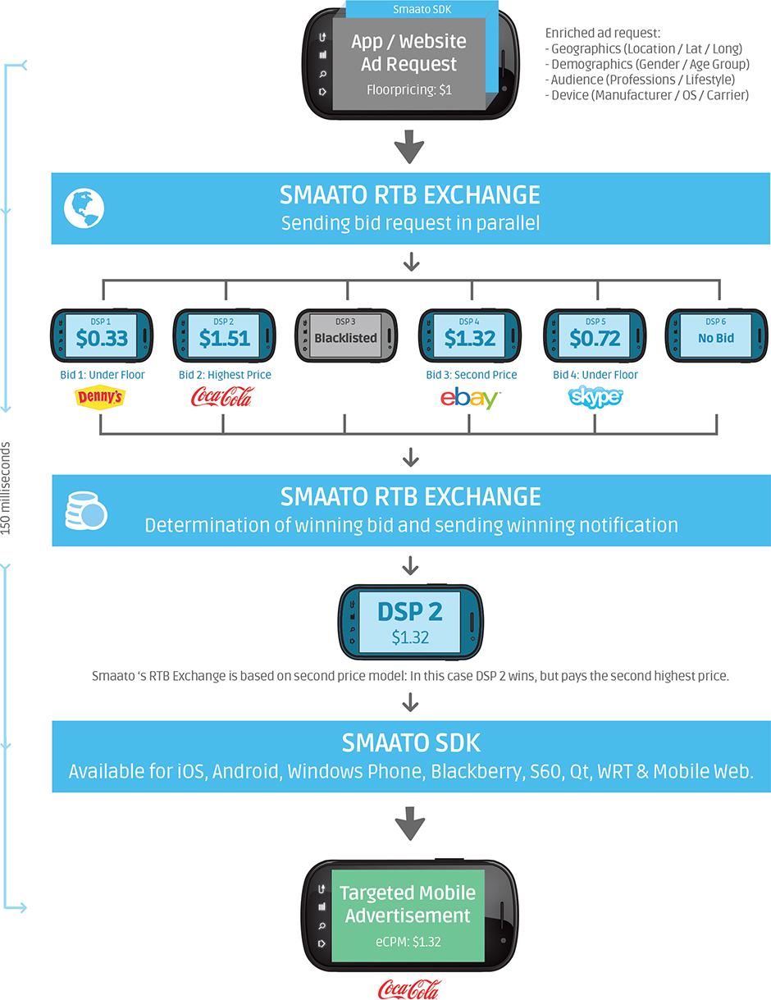

Monetizando APP Android com Smaato Ads

Opa, blz?

Nesse vídeo mostro como integrar a SDK de anúncios da plataforma Smaato na APP Android. O Smaato realiza leilões baseados em RTB (Real Time Bidding) que basicamente permite os anunciantes visualizarem seu inventário (mostro o preenchimento do formulário no vídeo) e então definir se vão investir nos leilões de sua APP ou não e também os valores. A plataforma promete valores de retorno maiores tanto para usuários que permitem anúncios em suas APPs quanto para usuários que estão anunciando. A integração é bem simples e é possível utilizar as mais modernas formas de anúncios (vídeo e richmedia, porém não rodaram no modo de teste!) além das convencionais.

Pontos negativos da plataforma: Quando em teste algumas características não funcionaram, como o anúncio em vídeo e em richmedia. É necessária avaliação da equipe Smaato para ter os anúncios liberados na APP (se for aprovado).

Pontos positivos: integração fácil e rápida, mesmo quando utilizando as formas mais sofisticadas de anúncios. A página de relatórios é bem simples, completa e os ganhos são apresentados rápidos (aparentemente 1 dia de delay). Pelo modelo de uso, RTB, a plataforma pode sim fornecer maiores ganhos para as APPs.

Obs. : é necessária uma conta no PayPal para obter o dinheiro.

A SDK tem outras características, como por exemplo, integração com o próprio AdMob, mas essa parte deixo contigo (é tranquilo, o zip da SDK e a documentação no site do Smaato têm um exemplo mostrando como fazer).

O link para download do projeto se encontra logo abaixo no post.

Segue links das páginas apresentadas no vídeo:

Site oficial Smaato ads mobile

https://www.smaato.com/

Página de documentação da SDK Android

http://www.smaato.com/developerguide/

Obs. : não esquecer das configurações do AndroidManifest.xml.

Segue imagem de funcionamento do leilão Smaato para apresentar o anúncio em sua APP:

